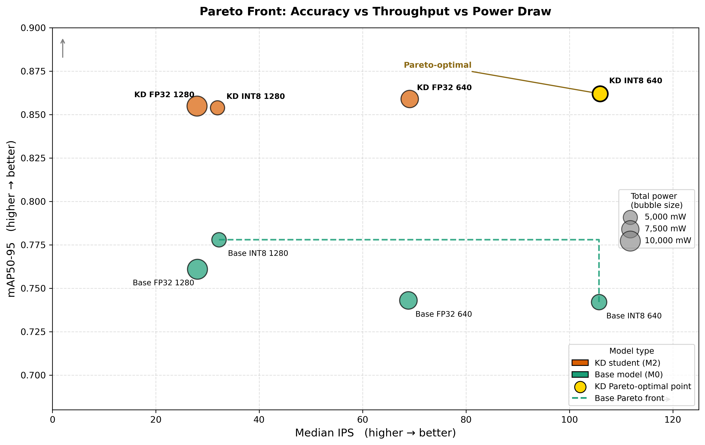

# Energy-Efficient Real-Time Plastic Identification on Apple Silicon

**Bachelor Thesis** — IU International University of Applied Sciences, 2026
**Author** — Israa Al Nhayle · [hassano.engineer@gmail.com](mailto:hassano.engineer@gmail.com)

---

> Can a nano-scale object detector running entirely on a smartphone chip classify plastic waste in real time — and do it more accurately *and* more efficiently than the unoptimized baseline?
> This project answers yes, by stacking three orthogonal optimizations on a single YOLO11n model.

---

## Key Results

| Configuration | mAP50-95 | Throughput (IPS) | Total Power |
|---|---|---|---|
| 11N-Base · FP32 · 1280 px *(baseline)* | 0.761 | 28.1 | 9,892 mW |
| 11N-KD · FP32 · 1280 px | 0.855 | 28.0 | 9,939 mW |
| 11N-Base · INT8 · 1280 px | 0.778 | 32.2 | 5,161 mW |
| 11N-KD · INT8 · 1280 px | 0.854 | 31.9 | 5,001 mW |
| 11N-Base · FP32 · 640 px | 0.743 | 68.8 | 7,644 mW |
| 11N-KD · FP32 · 640 px | 0.859 | 69.1 | 7,523 mW |
| 11N-Base · INT8 · 640 px | 0.742 | 105.7 | 5,854 mW |
| **11N-KD · INT8 · 640 px** *(Pareto-optimal)* | **0.862** | **105.9** | **5,837 mW** |

**Three optimizations combined beat the unoptimized baseline on every axis simultaneously:**
- **+13.3% mAP50-95** (0.761 → 0.862)
- **×3.8 throughput** (28 → 106 inferences/second)
- **−41% total power** (9,892 → 5,837 mW)

---

## Pareto Front



*Bubble area is proportional to total power draw. The gold point (KD · INT8 · 640 px) dominates all other configurations and is the only Pareto-optimal solution across the full three-objective space.*

---

## What Was Built

### 1. Custom Knowledge Distillation Trainer

Subclassed the Ultralytics `DetectionTrainer` to implement **response-based KD** at inference time — no changes to the model graph. Forward hooks attach to the `cv3` classification heads across all three detection scales; a KL-divergence soft-label loss is blended with the standard hard-label loss (α = 0.5, T = 2.0, Hinton et al. 2015).

```python
class KDDetectionTrainer(DetectionTrainer):
    def _setup_train(self):
        super()._setup_train()
        self._load_teacher()       # YOLO11s frozen teacher
        self._register_hooks()     # cv3[0/1/2] on student + teacher
        self._wrap_loss()          # inject KL term into criterion

    def _register_hooks(self):
        s_detect = self.model.model[-1]
        t_detect = self.teacher_model.model[-1]
        for i in range(len(s_detect.cv3)):
            s_detect.cv3[i].register_forward_hook(StudentHook(self._student_cache, i))
            t_detect.cv3[i].register_forward_hook(TeacherHook(self._teacher_cache, i))
```

### 2. Post-Training Quantization → Apple Neural Engine

INT8 export via CoreML (`coremltools`) redirects inference from the GPU (~8,500 mW active) to the ANE (~28 mW active) — a **300× reduction in GPU power**. Accuracy is preserved because the ANE dequantizes INT8 weights to FP16 before arithmetic.

### 3. Resolution Downscaling (1280 → 640 px)

Acts as an implicit regularizer. Combined with KD soft labels it produces a **super-additive generalization gain** — the 640 px KD INT8 model outperforms all 1280 px variants despite seeing less spatial information.

---

## Technical Stack

| Area | Tools / Concepts |
|---|---|
| Object detection | YOLO11n / 11s (Ultralytics) |
| Knowledge distillation | Response-based KD, KL divergence, PyTorch forward hooks |
| Quantization | Post-Training Quantization (PTQ), INT8, CoreML |
| Edge deployment | Apple Neural Engine (ANE), Apple Silicon M4 |
| Benchmarking | MLPerf Tiny–style 5-run median, macOS `powermetrics` |
| Visualization | Matplotlib, multi-objective Pareto front |
| Language | Python 3.12, PyTorch 2.11, coremltools |

---

## Repository Structure

```
src/
├── Training/
│   ├── 11L-Base_train.py        # YOLO11l baseline (OOM at epoch 118)
│   ├── 11S-Teacher_train.py     # YOLO11s KD teacher
│   ├── 11N-Base_train.py        # YOLO11n baseline
│   └── 11N-KD_train.py          # YOLO11n student — custom KD trainer (thesis core)
├── 11N-Base_val_recheck.py      # Re-validate nano baseline at imgsz=1280
├── 11N-KD_val_recheck.py        # Re-validate KD student at imgsz=1280
├── export_int8.py               # PTQ → CoreML INT8 export
├── latency_test.py              # 5-run median IPS / latency benchmark
├── power_test.py                # Inference loop synchronized with powermetrics
├── parse_power.py               # Parse CPU / GPU / ANE power from powermetrics log
└── pareto_front.py              # Multi-objective Pareto front visualization
assets/
└── pareto_front.png             # Figure 4 from the thesis
```

---

## How to Run

**Requirements:** macOS, Python 3.12, PyTorch 2.11+, Ultralytics, coremltools, Apple Silicon (M-series).

```bash
# 1. Train the KD student (requires teacher weights from 11S-Teacher_train.py first)
python src/Training/11N-KD_train.py

# 2. Export to CoreML INT8 (activates ANE at inference)
python src/export_int8.py

# 3. Benchmark latency
python src/latency_test.py

# 4. Benchmark power (run alongside macOS powermetrics in a second terminal)
python src/power_test.py

# 5. Reproduce the Pareto front figure
python src/pareto_front.py
```

> **Note:** Update `MODEL_PATH`, `TEACHER_PATH`, and `DATA_PATH` at the top of each script to match your local directory layout before running. Pretrained YOLO11 weights are downloaded automatically by Ultralytics on first use and are not committed to this repository.

---

## Model Nomenclature

| Name | Description |
|---|---|
| `11L-Base` | YOLO11 Large baseline (1280 px, OOM at epoch 118) |
| `11S-Teacher` | YOLO11 Small — KD teacher (1280 px) |
| `11N-Base` | YOLO11 Nano baseline (1280 px) |
| `11N-KD` | YOLO11 Nano student distilled from `11S-Teacher` |

The eight evaluated nano variants combine `{Base, KD} × {FP32, INT8} × {1280 px, 640 px}`.

---

## Dataset

Custom dataset of ~1,100 annotated bottle images across 3 classes: `PET_Pfand`, `PET_no_Pfand`, `HDPE`. Curated and hosted on Roboflow. See Appendix B of the thesis for dataset access details.

---

## Reproducibility

- Fixed random seed (`seed=1`) across all training runs.
- KD hyperparameters: `KD_ALPHA = 0.5`, `KD_TEMPERATURE = 2.0`.
- Hardware: Apple M4 MacBook Air, 16 GB unified memory, macOS Sequoia 15.7.4.
- Model weights, dataset images, and CoreML packages are excluded from this repo (see `.gitignore`).

---

## Reference

Al Nhayle, I. (2026). *Energy-Efficient Real-Time Plastic Identification: A Comparative Trade-off Analysis of GPU-based and NPU-optimized Inference* [Bachelor thesis]. IU International University of Applied Sciences.
